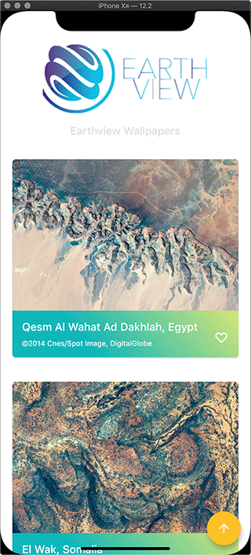
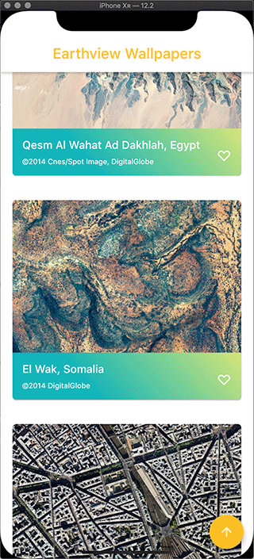
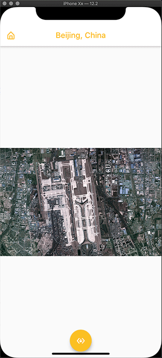
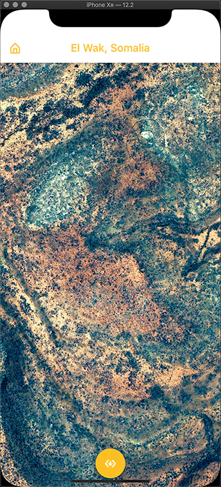

# Earthview Wallpapers

### Show some :love: and :star: the Earthview wallpapers repository to support the project

     

This repository containing a wallpaper download mobile app using Earth View images, Earth View is a collection of the most beautiful and striking landscapes found in Google Earth.

[Earthview](https://earthview.withgoogle.com/) Wallpaper app build using [Flutter](https://flutter.io/).

### App Screenshots

&nbsp;&nbsp;&nbsp;&nbsp;&nbsp;&nbsp;

### Created & Maintained By

[Chaminda Prasad](https://github.com/prasademc)

# License

    Copyright 2019 Chaminda Prasad

    Licensed under the Apache License, Version 2.0 (the "License");
    you may not use this file except in compliance with the License.
    You may obtain a copy of the License at

       http://www.apache.org/licenses/LICENSE-2.0

    Unless required by applicable law or agreed to in writing, software
    distributed under the License is distributed on an "AS IS" BASIS,
    WITHOUT WARRANTIES OR CONDITIONS OF ANY KIND, either express or implied.
    See the License for the specific language governing permissions and
    limitations under the License.

## Getting Started

This project is a starting point for a Flutter application.

A few resources to get you started if this is your first Flutter project:

- [Lab: Write your first Flutter app](https://flutter.dev/docs/get-started/codelab)
- [Cookbook: Useful Flutter samples](https://flutter.dev/docs/cookbook)

For help getting started with Flutter, view our
[online documentation](https://flutter.dev/docs), which offers tutorials,
samples, guidance on mobile development, and a full API reference.

